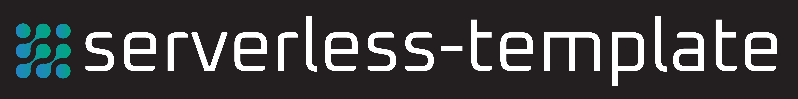
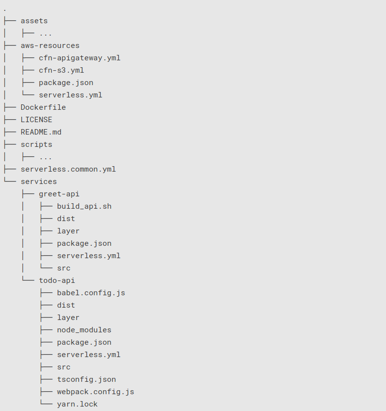
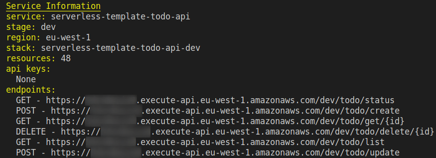

[](https://badge.fury.io/gh/unfor19%2Fserverless-template)
[](https://cloud.drone.io/unfor19/serverless-template)
[](http://www.serverless.com)

# serverless-template

Boilerplate template for the serverless-framework.

## Theory

<details><summary><b>Expand/Collapse</b>

</summary>

### Concepts

Learn how to use the Serverless Framework, while taking advantage of AWS Lambda Function, Lambda Layer, and API Gateway.

#### AWS Lambda Function

> _"AWS Lambda lets you run code without provisioning or managing servers. You pay only for the compute time you consume..."_ [[Source]](https://aws.amazon.com/lambda/)

###### [Pricing](https://aws.amazon.com/lambda/pricing/), [Limits](https://docs.aws.amazon.com/lambda/latest/dg/gettingstarted-limits.html), [CloudWatch Pricing](https://aws.amazon.com/cloudwatch/pricing/) and [S3 Pricing](https://aws.amazon.com/s3/pricing/)

---

#### AWS Lambda Layer

> _"...A layer is a ZIP archive that contains libraries, a [custom runtime](https://docs.aws.amazon.com/lambda/latest/dg/runtimes-custom.html), or other dependencies. With layers, you can use libraries in your function without needing to include them in your deployment package..."_ [[Source]](https://docs.aws.amazon.com/lambda/latest/dg/configuration-layers.html)

###### [S3 Pricing](https://aws.amazon.com/s3/pricing/)

---

#### AWS API Gateway

> _"...API Gateway handles all the tasks involved in accepting and processing up to hundreds of thousands of concurrent API calls, including traffic management, CORS support, authorization, and access control, throttling, monitoring, and API version management..."_ [[Source]](https://aws.amazon.com/api-gateway/)

###### [Pricing](https://aws.amazon.com/api-gateway/pricing/) and [Limits](https://docs.aws.amazon.com/apigateway/latest/developerguide/limits.html)

---

#### Serverless Framework

> _"The Serverless Framework helps you build serverless apps with radically less overhead and cost. It provides a powerful, unified experience to develop, deploy, test, secure and monitors your serverless applications..."_ [[Source]](https://serverless.com/framework/docs/)

###### [Comparisons](https://serverless.com/learn/comparisons/)

### Use Cases

<details><summary>
Serverless backend and Cron jobs
</summary>


[[Source]](https://www.simform.com/serverless-examples-aws-lambda-use-cases/)

</details>

<details><summary>
Data processing
</summary>


[[Source]](https://www.polyglotdeveloper.com/tools/2017-07-04-most-common-lambda-deployment-patterns/)

</details>

<details><summary>
Lambda@Edge Increase web application security
</summary>


</details>

###### [More use cases](https://serverless.com/learn/use-cases/)

### APIs

<details><summary>Project Tree
</summary>



</details>

- Each API is an isolated service that contains multiple functions
- All APIs share the same API Gateway - easier to manage
- The file [serverless.common.yml](./serverless.common.yml) contains mappings that are relevant to all APIs, such as region, allow_origin, user_pool_id, and more

#### APIs Structure

- serverless.yml - configuration for deployment - [Using Layers](https://serverless.com/framework/docs/providers/aws/guide/layers#using-your-layers)
- layer - deployed separately, these are the dependencies
- src - source code of API that is deployed by serverless
- package.json - contains the build, deploy and destroy scripts, and dev-dependencies
- yarn.lock - contains the list of dev-dependencies and their versions

### Layers

- **Never run** `yarn add some_package` **in an API folder**
- **Always use** `yarn add --dev some_package`**in an API folder**; Lambda Layer supplies the "real" dependencies
- There's no need to create a layer for AWS SDK (e.g aws-sdk, boto3) - These libraries are [provided by AWS automatically](https://docs.aws.amazon.com/lambda/latest/dg/lambda-runtimes.html)

#### Layer Structure

- serverless.yml - configuration for deploying the layer - [Deploying Layers](https://serverless.com/framework/docs/providers/aws/guide/layers#configuration)
- package.json - contains the scripts for building, deploying and destroying the layer
- nodejs/package.json - contains the dependencies that will be uploaded with this layer
- nodejs/yarn.lock - contains the list of dependencies and their versions

---

</details>

## Requirements

1. Install [Docker Engine](https://docs.docker.com/install/)

1. Clone this repository

1. Use this [Docker image](https://hub.docker.com/r/unfor19/serverless-template)

    <details><summary>Image Packages
      </summary>

    <table>
      <tr>
        <th>Package</th>
        <th>Version</th>
      </tr>
      <tr>
        <td>NodeJS</td>
        <td>12.16.1</td>
      </tr>
      <tr>
        <td>Python</td>
        <td>3.8.1</td>
      </tr>
      <tr>
        <td>bash</td>
        <td>5.0.11</td>
      </tr>
      <tr>
        <td>curl</td>
        <td>7.67.0</td>
      </tr>
      <tr>
        <td>jq</td>
        <td>20191114-85-g260888d269</td>
      </tr>
      <tr>
        <td>yarn</td>
        <td>1.22.0</td>
      </tr>
      <tr>
        <td>serverless-framework</td>
        <td>1.64.0</td>
      </tr>
      <tr>
        <td>TypeScript</td>
        <td>3.8.2</td>
      </tr>
    </table>

    </details>

   <details><summary>Image Usage Examples</summary>

   - With [aws-vault](https://github.com/99designs/aws-vault)
     ```bash
     $ (serverless-template) aws-vault exec PROFILE_NAME -- bash ./scripts/docker_run.sh
     ```
   - AWS Environment variables
     ```bash
     $ (serverless-template) export AWS_SECRET_ACCESS_KEY=A123123
     $ (serverless-template) export AWS_ACCESS_KEY_ID=B1232123123
     $ (serverless-template) export AWS_REGION=eu-west-1
     $ (serverless-template) export AWS_PROFILE=sls-template-dev
     $ (serverless-template) bash ./scripts/docker_run.sh
     ```
   - AWS Credentials & Config files

     ```bash
     $ (serverless-template) bash ./scripts/docker_run.sh
     ```

   **Tip**: Take a look at the [docker_run](./scripts/docker_run.sh) script

   </details>

## Getting Started

<details><summary>Goal
</summary>

Deploy two serverless services (APIs)

- todo-api: NodeJS 12.x (TypeScript) - ([CRUD](https://en.wikipedia.org/wiki/Create,_read,_update_and_delete))

  <details><summary>Result</summary>

  

  </details>

- greet-api: Python 3.8 - Send a name and get a greeting

To keep it simple, we're using an S3 bucket as a database. The contents are saved to the objects' [user-defined metadata](https://docs.aws.amazon.com/AmazonS3/latest/dev/UsingMetadata.html).

</details>

1. :whale2: Run Container

   ```bash
   $ (serverless-template) aws-vault exec PROFILE_NAME -- bash ./scripts/docker_run.sh
   ...                     # Pulling image ...
   /code (master)$         # We're in!
   ```

1. :hammer: Build App - this includes installing dependencies

   ```bash
    /code (master)$ bash ./scripts/app_build.sh
    🔎  Identifying services folders ...
    ...
    ✅  Finished
   ```

1. :arrows_clockwise: Deploy AWS resources - S3 Bucket and API Gateway

   ```bash
   /code/aws-resources (master)$ yarn deploy:dev
   ```

    <details><summary>
    CloudFormation templates
    </summary>

   #### API Gateway

   [ Ireland (eu-west-1)](https://eu-west-1.console.aws.amazon.com/cloudformation/home?region=eu-west-1#/stacks/quickcreate?templateURL=https://unfor19-serverless-template.s3-eu-west-1.amazonaws.com/cfn-apigateway.yml)

   #### S3 Bucket

   [ Ireland (eu-west-1)](https://eu-west-1.console.aws.amazon.com/cloudformation/home?region=eu-west-1#/stacks/quickcreate?templateURL=https://unfor19-serverless-template.s3-eu-west-1.amazonaws.com/cfn-s3.yml)

     <details><summary>
     More regions
     </summary>

   To deploy in other regions, replace AWS_REGION with the region's code.

   **API Gateway**

   ```bash
   https://AWS_REGION.console.aws.amazon.com/cloudformation/home?region=AWS_REGION#/stacks/quickcreate?templateURL=https://
   serverless-template.s3-eu-west-1.amazonaws.com/cfn-apigateway.yml
   ```

   **S3 Bucket**

   ```bash
   https://AWS_REGION.console.aws.amazon.com/cloudformation/home?region=AWS_REGION#/stacks/quickcreate?templateURL=https://
   serverless-template.s3-eu-west-1.amazonaws.com/cfn-s3.yml
   ```

     </details>

     </details>

1. :arrows_clockwise: Deploy AWS Lambda Layers

   ```bash
   /code/services/todo-api/layer (master)$   yarn deploy:dev
   /code/services/greet-api/layer (master)$  yarn deploy:dev
   ```

1. :arrows_clockwise: Deploy AWS Lambda Functions

   ```bash
   /code/services/todo-api (master)$  yarn deploy:dev
   /code/services/greet-api (master)$ yarn deploy:dev
   ```

## Usage

Replace `ENDPOINT` with the API Gateway's endpoint that was generated by serverless-framework, and `AWS_REGION` with the relevant region.

```bash
/code (master)$ APIGATEWAY_ENDPOINT=https://ENDPOINT.execute-api.AWS_REGION.amazonaws.com
```

#### Create

Replace `MY_CONTENT`

```bash
MY_CONTENT="some content"

curl --location --request POST ${APIGATEWAY_ENDPOINT}/dev/todo/create \
--header 'Content-Type: application/json' \
--data-raw '{ "content": "'"${MY_CONTENT}"'" }'
```

#### Get (Read)

Replace `MY_UUID`

```bash
MY_UUID='cf27a7de-f3f7-43a0-b12f-ff8016b7b7e0'

curl --location --request GET ${APIGATEWAY_ENDPOINT}/dev/todo/get/${MY_UUID}
```

#### Update

Replace `MY_UUID` and `MY_CONTENT`

```bash
MY_UUID='cf27a7de-f3f7-43a0-b12f-ff8016b7b7e0'
MY_CONTENT='wohoo new content!'

curl --location --request POST ${APIGATEWAY_ENDPOINT}/dev/todo/update \
--header 'Content-Type: application/json' \
--data-raw '  { "id": "'${MY_UUID}'", "content": "'"${MY_CONTENT}"'" }'
```

#### Delete

Replace `MY_UUID`

```bash
MY_UUID='cf27a7de-f3f7-43a0-b12f-ff8016b7b7e0'

curl --location --request DELETE ${APIGATEWAY_ENDPOINT}/dev/todo/delete/${MY_UUID}
```

#### List

```bash
curl --location --request GET ${APIGATEWAY_ENDPOINT}/dev/todo/list
```

#### Greet

Replace `MY_NAME`

```bash
MY_NAME="Willy"

curl --location --request GET "${APIGATEWAY_ENDPOINT}/dev/greet/${MY_NAME}"
```

## Modify

<details><summary><b>Expand/Collapse</b>
  </summary>

### Requirements

1. Clone this repository

1. Use this [Docker image](https://hub.docker.com/r/unfor19/serverless-template)

1. Install dev-dependencies for each API

   ```bash
   /code/services/todo-api (master)$  yarn install
   /code/services/greet-api (master)$ yarn install
   ```

1. Modify code in `src` and then build

   ```bash
   /code/services/todo-api (master)$ yarn build:dev
   /code/services/todo-api (master)$ yarn build:dev
   ```

### Manage Dependencies

#### Adding a new dependency

`layer: yarn add package_name`

```bash
/code/services/todo-api/layer/nodejs (master)$ yarn add uuid # or any other package
```

#### Layer name and package.json

Make sure that your layer name in the serverless file is similar to the layer names in package.json

```bash
# todo-api/layer/serverless.yml
custom.layers.[dev|staging|prod].[Tododev|Todostaging|Todoprod]

# todo-api/package.json
scripts: deploy:vault-dev|staging|prod .... --layer-name Tododev|Todostaging|Todoprod
```

#### Deploying a new Layer version

```bash
/code/services/todo-api/layer (master)$ yarn deploy

Serverless: Packaging service...
...
Serverless: Checking Stack update progress...
...
IMPORTANT! Do not forget to re-deploy the API to update Lambda Layer version
Done in 67.21s.
```

### Deploying and Redeploying the API

1. Upon deployment, the deployment script gets the latest version of Lambda Layer
2. When updating a Lambda Layer, you must re-deploy the API for it to use the latest Lambda Layer version

```bash
/code/services/todo-api (master)$ yarn deploy

yarn run v1.21.1
$ export layer_arn=$(aws-vault exec sls-template -- aws lambda list-layer-versions --layer-name Tododev | jq -r '.LayerVersions[0].LayerVersionArn') && aws-vault exec sls-template -- sls deploy --verbose --stage=dev
...
Serverless: Checking Stack update progress...
...
Done in 43.59s.
```

</details>

## Cleanup

1. Destroy AWS Lambda Functions

   ```bash
   /code/services/todo-api (master)$  yarn destroy:dev
   /code/services/greet-api (master)$ yarn destroy:dev
   ```

1. Destroy AWS Lambda Layers

   ```bash
   /code/services/todo-api/layer (master)$  yarn destroy:dev
   /code/services/greet-api/layer (master)$ yarn destroy:dev
   ```

1. Destroy S3 Bucket and API Gateway

   **Important!** Delete all the objects in the bucket before performing this action

   ```bash
   /code/services/aws-resources (master)$ yarn destroy:dev
   ```

---

## Also Check

- [Serverless Best Practices](https://serverless-stack.com) - a free resource to help you build full-stack production-ready Serverless applications
- [AWS Docs - Best Practices for Working with AWS Lambda Functions](https://docs.aws.amazon.com/lambda/latest/dg/best-practices.html)
- [AWS Blog - 10 Things Serverless Architects Should Know](https://aws.amazon.com/blogs/architecture/ten-things-serverless-architects-should-know/)
- [AWS Blog - Best Practices for Developing on AWS Lambda
  ](https://aws.amazon.com/blogs/architecture/best-practices-for-developing-on-aws-lambda/)
- [Git Repo - AWS Serverless Workshops](https://github.com/aws-samples/aws-serverless-workshops)

## Contributing

Report issues/questions/feature requests on in the [Issues](https://github.com/unfor19/serverless-template/issues) section.

Pull requests are welcome! Ideally, create a feature branch and issue for every single change you make. These are the steps:

1. Fork the repo.
2. Create your feature branch from master (`git checkout -b my-new-feature`).
3. Commit your remarkable changes (`git commit -am 'Added some feature'`).
4. Push to the branch (`git push origin my-new-feature`).
5. Create a new Pull Request and tell us about your changes.

## Authors

Created and maintained by [Meir Gabay](https://github.com/unfor19)

## License

This project is licensed under the MIT License - see the [LICENSE.md](LICENSE.md) file for details
